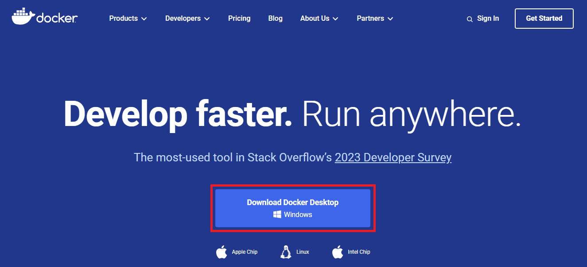

# What is Docker?

Docker is a software platform that allows you to build, test, and deploy applications in a **containers** to run on the host operating system.

# What are Containers?

A long time ago before there was Docker, we know about Virtual Machines (like VMware for example) to run software applications, where VM run applications inside a guest Operating System, which runs on virtual hardware powered by the server's host OS.

The problem using VM is the slow process of creating the VM itself, it also takes time to boot into the operating system in the VM.

Different when using VM, containers use the host operating system itself (no need to install another OS like using VM). So, containers will be more resource efficient and run faster than using a VM.

    
     
    <em>Diagram of Docker Container</em>

# Installing Docker

Docker runs natively on Linux operating system. So, for Windows or Mac users, we need to install the Docker app called **Docker Desktop**.

1. To install Docker Desktop, go to <a href="https://www.docker.com/">Docker</a> website.

2. Click Download Docker Desktop (it depend on what OS you used, in this case, i used Windows).

    

